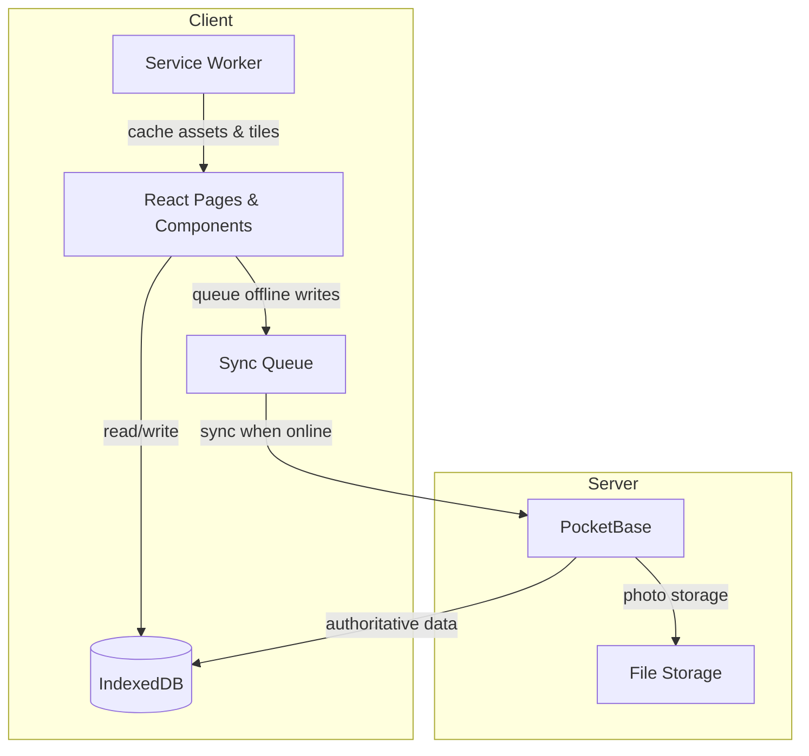
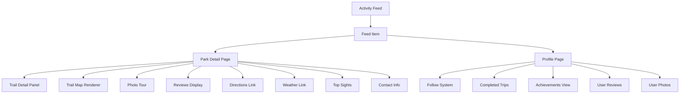

# Design Document — Social Profile and Park Details

## Overview

This design extends ForageWise with two complementary feature sets:

1. **Social Layer** — Follow system, activity feed, photo sharing, reviews, achievements, and public user profiles. These features let foragers connect, share discoveries, and track progress.
2. **Enhanced Park & Trail Details** — Rich trail metadata (elevation, surface, type, estimated time), interactive trail maps, reviews/ratings display, photo tours, directions, weather links, top sights, and contact information.

Both feature sets build on the existing offline-first architecture (IndexedDB + PocketBase sync queue) and must degrade gracefully when offline. Privacy defaults are strict: trips and logs are private by default, EXIF GPS data is stripped from photos, and reviews expose only display names.

### Key Design Decisions

- **PocketBase collections** are the authoritative store for social data (follows, reviews, photos, achievements). IndexedDB caches data for offline access and queues writes.
- **Trail metadata extensions** (elevation gain, surface type, trail type, trailheads) are added to the existing `Trail` type and seeded alongside existing park/trail data.
- **Naismith's rule** (3 mph + 30 min per 1000 ft gain) is implemented as a pure utility function for estimated hiking time.
- **Photo EXIF stripping** happens client-side before upload using the Canvas API, ensuring GPS data never leaves the device unless the user opts in.
- **Review aggregation** (average rating, count) is computed server-side by PocketBase and cached locally for offline display.
- **Leaflet** remains the map library; trail polylines use the existing `coordinates` array on the `Trail` type.

---

## Architecture

### High-Level Data Flow



### Component Architecture



### New PocketBase Collections

| Collection | Purpose | Key Fields |
|---|---|---|
| `follows` | Directional follow relationships | `followerId`, `followedId`, `createdAt` |
| `reviews` | Park/trail/species reviews | `userId`, `targetType`, `targetId`, `rating`, `text`, `createdAt`, `updatedAt` |
| `social_photos` | User-shared photos | `userId`, `targetType`, `targetId`, `file`, `caption`, `hasLocation`, `coordinates`, `createdAt` |
| `achievements` | Earned user achievements | `userId`, `achievementId`, `title`, `description`, `earnedAt` |
| `activity_feed` | Denormalized feed events | `userId`, `actionType`, `targetType`, `targetId`, `metadata`, `createdAt` |

### Offline Strategy

| Feature | Online | Offline |
|---|---|---|
| Trail metadata | Fetch from PB, cache in IDB | Read from IDB |
| Trail map | Live tiles + polyline | Cached tiles + polyline from IDB |
| Reviews (read) | Fetch paginated from PB | Show cached reviews from IDB |
| Reviews (write) | Submit to PB | Save draft in IDB, enqueue in sync queue |
| Photos (upload) | Upload to PB file storage | Store blob in IDB, enqueue upload |
| Follow/unfollow | Submit to PB | Enqueue in sync queue |
| Activity feed | Fetch from PB | Show cached feed items from IDB |
| Weather link | Show link | Hide link, show offline indicator |
| Profile (own) | Fetch from PB | Show cached profile from IDB |
| Profile (other) | Fetch from PB | Unavailable with offline indicator |

---

## Components and Interfaces

### Social Services

#### FollowService (`src/social/followService.ts`)

```typescript
interface FollowService {
  /** Follow a user. Queues offline. Returns false if self-follow attempted. */
  followUser(currentUserId: string, targetUserId: string): Promise<boolean>;

  /** Unfollow a user. Queues offline. */
  unfollowUser(currentUserId: string, targetUserId: string): Promise<boolean>;

  /** Check if currentUser follows targetUser. */
  isFollowing(currentUserId: string, targetUserId: string): Promise<boolean>;

  /** Get follower count for a user. */
  getFollowerCount(userId: string): Promise<number>;

  /** Get following count for a user. */
  getFollowingCount(userId: string): Promise<number>;
}
```

#### ReviewService (`src/social/reviewService.ts`)

```typescript
type ReviewTargetType = 'park' | 'trail' | 'species';

interface Review {
  id: string;
  userId: string;
  authorName: string;
  targetType: ReviewTargetType;
  targetId: string;
  rating: number;       // 1–5 integer
  text: string;         // 10–2000 characters
  createdAt: string;
  updatedAt: string;
  syncStatus: SyncStatus;
}

interface ReviewAggregation {
  averageRating: number;  // 1 decimal place
  totalCount: number;
}

interface ReviewService {
  /** Submit or update a review. Enforces one review per user per target. */
  submitReview(review: Omit<Review, 'id' | 'createdAt' | 'updatedAt' | 'syncStatus'>): Promise<Review>;

  /** Get paginated reviews for a target entity. */
  getReviews(targetType: ReviewTargetType, targetId: string, page: number, pageSize?: number): Promise<Review[]>;

  /** Get aggregate rating for a target entity. */
  getAggregation(targetType: ReviewTargetType, targetId: string): Promise<ReviewAggregation>;

  /** Validate review text (10–2000 chars). */
  validateReviewText(text: string): { valid: boolean; error?: string };
}
```

#### PhotoService (`src/social/photoService.ts`)

```typescript
interface SocialPhoto {
  id: string;
  userId: string;
  targetType: 'park' | 'trail' | 'species';
  targetId: string;
  blob: Blob;
  thumbnailBlob?: Blob;
  caption?: string;
  hasLocation: boolean;
  coordinates?: Coordinates;
  mimeType: 'image/jpeg' | 'image/png';
  createdAt: string;
  syncStatus: SyncStatus;
}

interface PhotoService {
  /** Upload a photo. Strips EXIF GPS unless opted in. Queues offline. */
  uploadPhoto(photo: Omit<SocialPhoto, 'id' | 'createdAt' | 'syncStatus' | 'thumbnailBlob'>, keepLocation: boolean): Promise<SocialPhoto>;

  /** Get photos for a target entity. Seed photos first, then user photos newest-first. */
  getPhotos(targetType: string, targetId: string): Promise<SocialPhoto[]>;

  /** Strip EXIF data from an image blob. */
  stripExif(blob: Blob): Promise<Blob>;

  /** Validate file type and size (JPEG/PNG, max 10 MB). */
  validatePhoto(blob: Blob): { valid: boolean; error?: string };
}
```

#### AchievementTracker (`src/social/achievementTracker.ts`)

```typescript
interface Achievement {
  id: string;
  userId: string;
  achievementId: string;
  title: string;
  description: string;
  earnedAt: string;
  syncStatus: SyncStatus;
}

interface AchievementCriteria {
  id: string;
  title: string;
  description: string;
  evaluate(userId: string): Promise<boolean>;
}

interface AchievementTracker {
  /** Evaluate all criteria after a trip is completed. */
  evaluateOnTripComplete(userId: string, tripId: string): Promise<Achievement[]>;

  /** Get all earned achievements for a user. */
  getAchievements(userId: string): Promise<Achievement[]>;
}
```

#### ActivityFeedService (`src/social/activityFeedService.ts`)

```typescript
type FeedActionType = 'review_posted' | 'photo_shared' | 'trip_completed' | 'achievement_earned';

interface FeedItem {
  id: string;
  userId: string;
  userName: string;
  userAvatar?: string;
  actionType: FeedActionType;
  targetType: string;
  targetId: string;
  targetName: string;
  metadata?: Record<string, unknown>;
  createdAt: string;
}

interface ActivityFeedService {
  /** Fetch paginated feed for the current user (from followed users). */
  getFeed(userId: string, page: number, pageSize?: number): Promise<FeedItem[]>;

  /** Get cached feed items from IndexedDB. */
  getCachedFeed(userId: string): Promise<FeedItem[]>;
}
```

### Park Detail Components

#### TrailDetailPanel (`src/components/parks/TrailDetailPanel.tsx`)

Displays extended trail metadata: length, elevation gain, estimated time, difficulty, type, surface, and trailhead locations.

Props:
```typescript
interface TrailDetailPanelProps {
  trail: TrailExtended;
  parkCoordinates: Coordinates;
}
```

#### TrailMapRenderer (`src/components/parks/TrailMapRenderer.tsx`)

Renders a Leaflet map with the trail polyline and trailhead markers. Fits bounds on initial load. Works offline with cached tiles.

Props:
```typescript
interface TrailMapRendererProps {
  trail: TrailExtended;
  trailheads: Trailhead[];
}
```

#### PhotoTour (`src/components/parks/PhotoTour.tsx`)

Horizontally swipeable photo gallery with lightbox. Shows seed photos first, then user photos newest-first.

Props:
```typescript
interface PhotoTourProps {
  seedPhotos: string[];
  userPhotos: SocialPhoto[];
}
```

#### ReviewsSection (`src/components/parks/ReviewsSection.tsx`)

Displays aggregate rating, review list with pagination, and "Write a Review" button.

Props:
```typescript
interface ReviewsSectionProps {
  targetType: ReviewTargetType;
  targetId: string;
  isAuthenticated: boolean;
}
```

### Utility Functions

#### `estimateHikingTime` (`src/utils/trailUtils.ts`)

```typescript
/**
 * Estimate hiking time using Naismith's rule.
 * Base: 3 mph + 30 minutes per 1000 ft elevation gain.
 *
 * @param distanceMiles - Trail distance in miles
 * @param elevationGainFeet - Total elevation gain in feet
 * @returns Estimated time in minutes
 */
function estimateHikingTime(distanceMiles: number, elevationGainFeet: number): number;
```

#### `formatHikingTime` (`src/utils/trailUtils.ts`)

```typescript
/**
 * Format minutes into a human-readable string like "2h 15m" or "45m".
 */
function formatHikingTime(minutes: number): string;
```

#### `buildDirectionsUrl` (`src/utils/directionsUtils.ts`)

```typescript
/**
 * Build a deep link URL for the device's maps application.
 * Uses Google Maps URL scheme as the default.
 */
function buildDirectionsUrl(coordinates: Coordinates): string;
```

#### `buildWeatherUrl` (`src/utils/weatherUtils.ts`)

```typescript
/**
 * Build a weather.gov forecast URL from GPS coordinates.
 */
function buildWeatherUrl(coordinates: Coordinates): string;
```

---

## Data Models

### Extended Trail Type

The existing `Trail` interface is extended with new fields:

```typescript
interface TrailExtended extends Trail {
  elevationGain?: number;        // feet
  trailType?: 'loop' | 'out-and-back' | 'point-to-point';
  surfaceType?: 'paved' | 'gravel' | 'dirt' | 'rocky' | 'mixed';
  trailheads?: Trailhead[];
  topSights?: string[];
}

interface Trailhead {
  name: string;
  coordinates: Coordinates;
}
```

### New IndexedDB Stores (DB Version 3)

| Store | Key | Indexes |
|---|---|---|
| `follows` | `id` | `by-followerId`, `by-followedId` |
| `reviews` | `id` | `by-targetType-targetId`, `by-userId`, `by-createdAt`, `by-syncStatus` |
| `socialPhotos` | `id` | `by-targetType-targetId`, `by-userId`, `by-createdAt`, `by-syncStatus` |
| `achievements` | `id` | `by-userId`, `by-earnedAt` |
| `feedItems` | `id` | `by-userId`, `by-createdAt` |
| `reviewAggregations` | `id` (composite: `{targetType}-{targetId}`) | — |

### Review Data Model

```typescript
interface ReviewLocal {
  id: string;
  userId: string;
  authorName: string;
  targetType: 'park' | 'trail' | 'species';
  targetId: string;
  rating: number;       // integer 1–5
  text: string;         // 10–2000 characters
  createdAt: string;
  updatedAt: string;
  syncStatus: SyncStatus;
}
```

### Review Aggregation Cache

```typescript
interface ReviewAggregationLocal {
  id: string;                    // "{targetType}-{targetId}"
  targetType: 'park' | 'trail' | 'species';
  targetId: string;
  averageRating: number;         // 1 decimal place
  totalCount: number;
  lastUpdated: string;
}
```

### Follow Relationship

```typescript
interface FollowLocal {
  id: string;
  followerId: string;
  followedId: string;
  createdAt: string;
  syncStatus: SyncStatus;
}
```

### Feed Item Cache

```typescript
interface FeedItemLocal {
  id: string;
  userId: string;
  userName: string;
  userAvatar?: string;
  actionType: FeedActionType;
  targetType: string;
  targetId: string;
  targetName: string;
  metadata?: Record<string, unknown>;
  createdAt: string;
}
```

### Achievement Record

```typescript
interface AchievementLocal {
  id: string;
  userId: string;
  achievementId: string;
  title: string;
  description: string;
  earnedAt: string;
  syncStatus: SyncStatus;
}
```

### User Profile Extension

The existing `UserProfileLocal` is extended with optional social fields:

```typescript
interface UserProfileExtended extends UserProfileLocal {
  bio?: string;
  followerCount?: number;
  followingCount?: number;
  completedTripCount?: number;
  achievementCount?: number;
  defaultVisibility: 'private' | 'public';  // defaults to 'private'
}
```


---

## Correctness Properties

*A property is a characteristic or behavior that should hold true across all valid executions of a system — essentially, a formal statement about what the system should do. Properties serve as the bridge between human-readable specifications and machine-verifiable correctness guarantees.*

### Property 1: Follow/unfollow round-trip

*For any* two distinct user IDs (A, B), calling `followUser(A, B)` then `isFollowing(A, B)` shall return true, and subsequently calling `unfollowUser(A, B)` then `isFollowing(A, B)` shall return false.

**Validates: Requirements 1.1, 1.2**

### Property 2: Self-follow prevention

*For any* user ID, calling `followUser(userId, userId)` shall return false and `isFollowing(userId, userId)` shall return false.

**Validates: Requirements 1.6**

### Property 3: Feed reverse-chronological ordering

*For any* set of feed items with distinct timestamps, `getFeed` shall return them in strictly descending order by `createdAt`.

**Validates: Requirements 2.1**

### Property 4: Feed pagination cap

*For any* number of feed items N ≥ 0, a single call to `getFeed` with default page size shall return at most 20 items.

**Validates: Requirements 2.6**

### Property 5: Photo file validation

*For any* blob with a MIME type and file size, `validatePhoto` shall return `{ valid: true }` if and only if the MIME type is `image/jpeg` or `image/png` AND the file size is ≤ 10 MB. All other inputs shall be rejected.

**Validates: Requirements 3.2**

### Property 6: EXIF GPS stripping

*For any* JPEG or PNG image blob, calling `stripExif` shall produce a blob that, when decoded, contains no GPS coordinate metadata. The visual content of the image shall be preserved.

**Validates: Requirements 3.5, 15.2**

### Property 7: Review storage round-trip

*For any* valid review (rating 1–5, text 10–2000 characters, valid target type and ID), submitting the review and then retrieving reviews for that target shall return a review with matching `userId`, `targetId`, `rating`, and `text`.

**Validates: Requirements 4.1**

### Property 8: One review per user per target (idempotence)

*For any* user ID and target entity, submitting two reviews shall result in exactly one review for that user-target pair, and the stored review shall match the most recently submitted content.

**Validates: Requirements 4.2**

### Property 9: Review sorting and pagination

*For any* set of reviews for a target entity, `getReviews` shall return them in descending order by `createdAt`, with at most 10 reviews per page.

**Validates: Requirements 4.4**

### Property 10: Review text length validation

*For any* string, `validateReviewText` shall return `{ valid: true }` if and only if the trimmed string length is between 10 and 2000 characters inclusive. Strings outside this range shall be rejected with an appropriate error message.

**Validates: Requirements 4.6, 4.7**

### Property 11: Visibility filtering

*For any* set of trips and achievements with mixed `visibility` values ('private' | 'public'), when viewed by a user other than the profile owner, only items with `visibility === 'public'` shall be returned.

**Validates: Requirements 5.5, 13.4, 15.4**

### Property 12: Hiking time estimation (Naismith's rule)

*For any* non-negative distance in miles (d) and non-negative elevation gain in feet (e), `estimateHikingTime(d, e)` shall return `(d / 3) * 60 + (e / 1000) * 30`. Additionally, the function is monotonic: increasing distance or elevation gain shall never decrease the estimated time.

**Validates: Requirements 6.3**

### Property 13: Review aggregation computation

*For any* non-empty array of integer ratings (each 1–5), the computed aggregation shall have `averageRating` equal to the arithmetic mean rounded to one decimal place, and `totalCount` equal to the array length.

**Validates: Requirements 8.1**

### Property 14: Photo tour ordering

*For any* combination of seed photos and user-submitted photos, the photo tour shall display all seed photos before any user photos, and user photos shall be sorted in descending order by `createdAt`.

**Validates: Requirements 9.2**

### Property 15: Directions URL construction

*For any* valid GPS coordinates (latitude -90 to 90, longitude -180 to 180), `buildDirectionsUrl` shall return a URL string that contains the latitude and longitude values as substrings.

**Validates: Requirements 10.1, 10.2**

### Property 16: Weather URL construction

*For any* valid GPS coordinates (latitude -90 to 90, longitude -180 to 180), `buildWeatherUrl` shall return a URL string that contains the latitude and longitude values and includes "weather.gov" as a substring.

**Validates: Requirements 11.1**

### Property 17: Sync queue FIFO ordering

*For any* sequence of sync queue items with distinct `createdAt` timestamps, the sync queue shall process items in ascending order by `createdAt` (oldest first).

**Validates: Requirements 14.4**

### Property 18: Default profile privacy

*For any* newly created user profile, the `defaultVisibility` field shall be `'private'`.

**Validates: Requirements 15.1**

### Property 19: Review privacy — no email or GPS exposure

*For any* review returned by `getReviews`, the review object shall contain an `authorName` field but shall not contain the author's email address or GPS coordinates.

**Validates: Requirements 15.5**

---

## Error Handling

### Network Errors

| Scenario | Behavior |
|---|---|
| Follow/unfollow fails (offline) | Enqueue in sync queue with `syncStatus: 'pending'`. Show optimistic UI update. |
| Review submission fails (offline) | Save draft to IndexedDB `reviews` store with `syncStatus: 'pending'`. Enqueue in sync queue. |
| Photo upload fails (offline) | Store blob in IndexedDB `socialPhotos` store. Enqueue upload in sync queue. |
| Photo upload fails after 3 retries | Mark sync queue item as `syncStatus: 'failed'`. Show toast notification to user. |
| Feed fetch fails (offline) | Fall back to cached feed items from IndexedDB. Show offline indicator. |
| Profile fetch fails (other user, offline) | Show "Profile unavailable offline" message. |

### Validation Errors

| Scenario | Behavior |
|---|---|
| Review text < 10 characters | Reject submission. Display inline validation: "Review must be at least 10 characters." |
| Review text > 2000 characters | Reject submission. Display inline validation: "Review must be 2000 characters or fewer." |
| Review rating outside 1–5 | Reject submission. This should not occur with the star-rating UI but is enforced server-side. |
| Photo wrong format | Reject upload. Display: "Only JPEG and PNG images are accepted." |
| Photo > 10 MB | Reject upload. Display: "Photo must be 10 MB or smaller." |
| Self-follow attempt | Return false silently. The UI should not show a follow button on the user's own profile. |

### Sync Conflicts

When a review is edited on another device while a local edit is pending:
1. The sync queue detects a version conflict (server version is newer than the local `clientVersion`).
2. The local version is preserved in IndexedDB.
3. The conflict is flagged with `syncStatus: 'conflict'`.
4. A notification prompts the user to resolve the conflict (keep local, keep server, or merge).

### Graceful Degradation

Sections that require network connectivity display clear offline indicators:
- **Weather link**: Hidden offline; replaced with "Weather data requires an internet connection."
- **Live reviews from other users**: Show cached reviews with a banner: "Showing cached reviews. Connect to see the latest."
- **Other user profiles**: Show "Profile unavailable offline" if not cached.
- **Activity feed**: Show cached items with a banner: "Showing cached activity. Connect to refresh."

---

## Testing Strategy

### Property-Based Tests (fast-check, minimum 100 iterations each)

The project already uses `fast-check` with `vitest`. Each property from the Correctness Properties section maps to a single property-based test file or test block in `tests/properties/`.

| Property | Test File | What Varies |
|---|---|---|
| 1: Follow/unfollow round-trip | `social-follow.test.ts` | Random user ID pairs |
| 2: Self-follow prevention | `social-follow.test.ts` | Random user IDs |
| 3: Feed chronological ordering | `activity-feed.test.ts` | Random feed items with timestamps |
| 4: Feed pagination cap | `activity-feed.test.ts` | Random feed sizes (0–100) |
| 5: Photo file validation | `photo-validation.test.ts` | Random MIME types and file sizes |
| 6: EXIF GPS stripping | `photo-exif.test.ts` | Random image blobs with GPS metadata |
| 7: Review storage round-trip | `review-service.test.ts` | Random valid reviews |
| 8: One review per user per target | `review-service.test.ts` | Random user/target pairs with two submissions |
| 9: Review sorting and pagination | `review-service.test.ts` | Random review sets with timestamps |
| 10: Review text validation | `review-validation.test.ts` | Random strings (0–3000 chars) |
| 11: Visibility filtering | `visibility-filter.test.ts` | Random items with mixed visibility |
| 12: Hiking time estimation | `trail-utils.test.ts` | Random distance/elevation values |
| 13: Review aggregation | `review-aggregation.test.ts` | Random arrays of ratings (1–5) |
| 14: Photo tour ordering | `photo-tour-ordering.test.ts` | Random seed + user photo sets |
| 15: Directions URL construction | `directions-utils.test.ts` | Random GPS coordinates |
| 16: Weather URL construction | `weather-utils.test.ts` | Random GPS coordinates |
| 17: Sync queue FIFO ordering | `sync-queue-order.test.ts` | Random sequences of queue items |
| 18: Default profile privacy | `profile-defaults.test.ts` | Random user data |
| 19: Review privacy | `review-privacy.test.ts` | Random reviews with full user data |

**Configuration:**
- Library: `fast-check` (already installed)
- Runner: `vitest --run`
- Minimum iterations: `{ numRuns: 100 }`
- Tag format: `Feature: social-profile-and-park-details, Property {N}: {title}`

### Unit Tests (example-based)

Unit tests cover specific examples, edge cases, and UI rendering:

- **Follow system**: Verify follow button state toggles, follower/following counts render.
- **Review form**: Verify form appears on "Write a Review" click, validation messages display, star rating UI works.
- **Trail metadata display**: Verify each metadata field (length, elevation, difficulty, type, surface, trailheads) renders correctly for known data.
- **Conditional sections**: Verify "Getting There" section omitted when `gettingThere` is absent; contact section omitted when no phone/website; top sights omitted when no data.
- **Directions links**: Verify `tel:` protocol for phone, `target="_blank"` for website, Google Maps URL for directions.
- **Weather link**: Verify link visible online, hidden offline with message.
- **Profile tabs**: Verify all four tabs (trips, achievements, reviews, photos) render.
- **Lightbox**: Verify photo tap opens lightbox.
- **Offline indicators**: Verify offline banners appear on weather, feed, and review sections.

### Integration Tests

- **Sync queue round-trip**: Queue a follow, review, and photo offline; restore connectivity; verify all sync to PocketBase.
- **PocketBase collection rules**: Verify server rejects unauthorized follow/review operations.
- **Offline park detail**: Seed IndexedDB, go offline, verify full park detail page renders with all trail metadata.
- **Photo upload pipeline**: Upload photo, verify EXIF stripped, thumbnail generated, stored in PocketBase file storage.

### E2E Tests (Playwright)

- **Park detail page**: Navigate to a park, verify all sections render (trails, reviews, photos, directions, weather, contact).
- **Follow flow**: Log in, visit another user's profile, follow, verify feed shows their activity.
- **Review flow**: Log in, navigate to park, write review, verify it appears in the reviews section.
- **Offline degradation**: Go offline via network emulation, verify trail metadata renders, weather link hidden, offline indicators visible.
